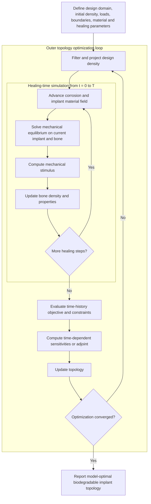
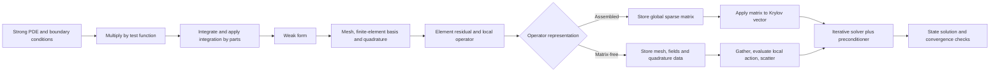
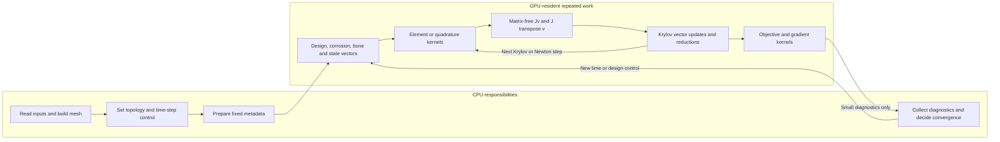

# Complete project explanation and evaluator guide

## How to use this guide

This handbook explains the complete idea behind the presentation titled **A Matrix-Free GPU-Accelerated Topology Optimization Framework for Biodegradable Implants Using Coupled Reaction-Diffusion Corrosion and Bone Remodeling**. It is written for the three team members, not for a numerical-methods specialist. Read the short story first, then use the technical sections to prepare for questions.

Every technical statement in this guide belongs to one of three categories:

- **Fixed by the deck:** The presentation explicitly states or shows this item. The team can describe it as part of the proposed project.
- **Proposed implementation:** This is a technically reasonable way to implement the project, but the deck does not fix it. Present it as an option or current plan, not as a completed choice.
- **Open choice:** The team must still select, formulate, calibrate, implement, or validate this item. Do not pretend it has already been decided.

The equations in this guide are teaching examples. They show the mathematical shape of the problem. They are not the project's final governing equations unless the team later chooses, documents, and validates them.

### Important presentation note about slides 5 and 8

Slide 8 duplicates the activity-time chart already shown on slide 5, and it appears after the Thank You slide. Hide slide 8 during the main presentation, or treat it as a backup slide for timeline questions. Showing a duplicate after Thank You can make the ending look accidental.

## The project in one sentence

The project aims to design a biodegradable implant whose shape and material distribution provide enough support early in healing, gradually transfer load back to bone as corrosion reduces the implant, and remain computationally practical to optimize through a matrix-free GPU finite-element solver.

## The full story in simple language

A conventional structural optimization often asks, "What is the best shape at the day of implantation?" This project asks a harder question: "What is the best initial shape when the implant, bone, and load sharing will all change during healing?"

The implant begins with an initial topology. A corrosion model advances the implant state through healing time and changes its material field, geometry, or effective stiffness. A mechanics model then calculates displacement, stress, stiffness, and load transfer for the current implant and bone. The mechanical stimulus drives a bone-remodeling model, which changes bone density and material properties. That changed bone affects later mechanical calculations. The process repeats from time zero to a chosen healing time (T).

After the complete healing simulation, the optimizer measures whether the design supplied enough mechanical support, encouraged a suitable bone response, and satisfied volume and design constraints. Sensitivities explain how a small change in every design variable would change the objective and constraints. The optimizer updates the topology, and the full healing simulation runs again. This outer loop continues until the optimization satisfies clear convergence checks.

The deck makes one deliberate simplification: corrosion is not stress-driven in the first framework. Mechanics receives the degraded implant state, but stress does not accelerate corrosion. This reduces the first coupling from a two-way corrosion-mechanics problem to a simpler one-way link from corrosion to mechanics.

The intended contribution is the tested integration of these parts. The project should not claim that corrosion modeling, bone remodeling, topology optimization, FEM, adjoints, or GPU computing is individually new.

## Motivation

### Why use a biodegradable implant?

A temporary implant must stabilize an injury while tissue heals. A permanent implant may remain after its main mechanical job is complete. In some cases, removing it requires another operation. A biodegradable implant is intended to provide temporary support and then lose material through controlled degradation.

The design problem is a timing problem:

- If degradation is too fast, the implant may lose strength or stiffness before the bone can support the load.
- If degradation is too slow, the implant may remain too stiff for too long and continue shielding the bone from normal mechanical stimulus.
- If degradation is spatially uneven, a thin or highly loaded region may fail even when the total remaining mass looks acceptable.
- If the initial topology is designed only for time zero, it may perform badly at a later healing stage.

The project therefore optimizes performance over a healing history rather than at one instant.

### What is stress shielding?

Bone and implant share the applied load. If the implant is much stiffer than the surrounding bone and is strongly connected to it, the implant can carry a large portion of that load. The bone then sees less stress or strain than it would naturally see. This reduction in mechanical stimulus is called stress shielding.

Many remodeling theories assume that persistent under-stimulation can lead to bone resorption. Stress shielding is therefore a load-transfer problem, not simply a material-name problem. It depends on implant stiffness, geometry, position, interface or bonding conditions, bone properties, and the applied loads.

The safe claim is that a carefully designed biodegradable implant may reduce prolonged stress shielding by lowering structural stiffness over time. Do not say that biodegradation automatically eliminates stress shielding.

### Strength and stiffness are different

Evaluators often ask about these two words because presentations sometimes mix them.

- **Stiffness** describes resistance to deformation. A stiff structure moves less under a given load. For a simple bar, structural stiffness is proportional to (EA/L), so it depends on Young's modulus (E), area (A), and length (L).
- **Strength** describes how much stress or load a material or structure can withstand before yielding, fracturing, buckling, or otherwise failing.
- **Compliance** is a common inverse measure of stiffness. Lower compliance usually means a stiffer structure for the specified load and supports.

An implant can be stiff but not sufficiently strong at a corroded notch. It can also retain enough strength while becoming less stiff. The project must eventually state which failure and support measures it enforces. A compliance constraint alone does not prove fatigue life, fracture safety, or local stress safety.

## Objectives and novelty

### Objectives fixed by the deck

1. Optimize biodegradable implant topology for improved structural performance.
2. Predict and control time-dependent degradation while maintaining mechanical integrity through healing.
3. Develop an integrated and computationally scalable framework for degradation-aware implant optimization.

### A defensible novelty statement

The selected literature supports separate parts of the framework, but none of the four highlighted papers demonstrates the exact proposed chain of reaction-diffusion corrosion, mechanics, remodeling feedback, time-dependent topology sensitivities, and matrix-free GPU solution in one biodegradable-implant optimization.

This is an **integration and computational-method contribution**. A careful sentence is:

> The project proposes to integrate degradation, evolving mechanics, bone remodeling, time-dependent topology optimization, and a matrix-free GPU solver in one testable framework. The novelty claim concerns this combination and its validation, not the invention of each individual component.

### Open choices that must stay visibly open

The deck does not yet fix the following items:

- Exact implant type or anatomical site.
- Exact biodegradable material or alloy.
- Patient-specific or idealized geometry.
- Loading cases and interface conditions.
- Reaction-diffusion species, reaction terms, diffusivities, and boundary conditions.
- Moving-interface, phase-field, level-set, continuous-damage, or element-removal representation.
- Bone-remodeling stimulus and evolution law.
- Linear or nonlinear mechanics, contact, plasticity, fracture, and fatigue.
- Finite-element type, order, mesh, and software library.
- Explicit, implicit, staggered, fixed-point, or monolithic time coupling.
- Matrix-free kernel design and GPU programming framework.
- Krylov solver and preconditioner.
- Density interpolation, filter radius, projection parameters, optimizer, and move limits.
- Exact objective, time aggregation, and constraints.
- Calibration datasets, validation datasets, and uncertainty model.

These are not weaknesses when stated honestly. They are the decisions and experiments that the BTP must complete.

## Glossary

| Term | Plain meaning |
|---|---|
| AD | Automatic differentiation. Software applies the chain rule to code operations to calculate derivatives accurately, without manually deriving every expression. |
| Adjoint | A backward sensitivity calculation that obtains gradients with respect to many design variables at a cost mainly controlled by the number of scalar objectives or constraints. |
| Algebraic system | A finite set of equations such as $Kx=f$ or $R(x)=0$ produced after discretization. |
| Assembled matrix | A stored global sparse matrix formed by adding all element contributions. |
| Bone remodeling | A model in which bone density, geometry, or properties change in response to mechanical or biological stimulus. |
| Boundary condition | Information imposed on the boundary, such as fixed displacement, traction, concentration, or chemical flux. |
| Compliance | Work done by the applied load; in common linear static settings it is an inverse measure of stiffness. |
| Constitutive law | A relation between physical quantities, such as stress and strain or bone modulus and density. |
| Convergence | Evidence that an iterative solution, time discretization, mesh, coupling, or optimization has become sufficiently stable by a defined test. |
| Corrosion field | A numerical variable that represents chemical concentration, degradation, remaining material, or an interface state. |
| CPU | A general-purpose processor with strong serial performance and relatively few powerful cores. |
| DAE | Differential algebraic equation. It contains both time-evolving equations and algebraic constraints, such as quasi-static mechanical equilibrium. |
| Design density | A topology-optimization variable, often between zero and one, that represents void-to-solid material distribution before or after filtering. |
| Diffusion | Spatial spreading driven by a concentration gradient. |
| Dirichlet condition | A prescribed value, such as fixed displacement or specified concentration. |
| FEM | Finite element method. A method that divides a domain into elements and approximates fields with local basis functions. |
| Filter | A spatial averaging operation used to control minimum feature size and suppress checkerboard patterns. |
| GPU | A processor with many parallel execution units and high memory bandwidth. |
| Healing time | The slow physical time over which corrosion and remodeling evolve. It is different from the iteration count of a solver. |
| Jacobian | The derivative of a residual vector with respect to the unknown vector. |
| Jacobian-vector product | The action $Jv$, computed without necessarily storing $J$. |
| KKT measure | A numerical check based on the Karush-Kuhn-Tucker optimality conditions. In simple terms, it tests whether the design is close to satisfying the mathematical conditions of a constrained optimum. |
| Krylov solver | An iterative linear solver that builds a solution from repeated operator applications, dot products, and vector updates. |
| Load transfer | The way an external load is divided between the implant, bone, and their interface. |
| Mass matrix | The FEM matrix multiplying a time derivative in a transient equation. |
| Matrix-free | Applying an operator to a vector without storing the full global matrix. |
| Mechanical integrity | Adequate structural support under the chosen measures and loads. The exact measures must be defined. |
| Mesh | The collection of finite elements covering the computational domain. |
| MGPCG | Multigrid-preconditioned conjugate gradient. It combines conjugate-gradient iteration with a multigrid preconditioner to solve suitable symmetric positive-definite systems efficiently. |
| Multigrid | A solver or preconditioner that attacks error at several spatial resolutions. |
| MMA | Method of moving asymptotes. A gradient-based constrained optimizer commonly used in topology optimization. It builds and solves a simpler local approximation at each design iteration. |
| Neumann condition | A prescribed flux or traction on a boundary. |
| Objective | The scalar quantity the optimizer minimizes or maximizes. |
| ODE | Ordinary differential equation, often obtained after spatially discretizing a transient PDE. |
| Operator | A rule that maps an input field or vector to an output field or vector. It may or may not be stored as a matrix. |
| PDE | Partial differential equation involving changes across space and possibly time. |
| Phase field | A smooth variable that distinguishes phases across a diffuse interface and evolves according to a chosen free-energy or kinetic law. |
| Preconditioner | An approximate inverse or transformation that makes an iterative linear system easier to solve. |
| Projection | A smooth mapping that pushes filtered design densities closer to solid or void. |
| Reaction | Local production or consumption of a species or state variable. |
| Residual | The mismatch remaining when a trial solution is inserted into the discrete equations. The exact solution has zero residual in the mathematical model. |
| Semi-discrete system | A PDE discretized in space but still continuous in time, usually an ODE or DAE. |
| Sensitivity | The derivative of an objective, constraint, or state with respect to a parameter or design variable. |
| SIMP | Solid isotropic material with penalization. A density-based interpolation that discourages unclear intermediate material densities and pushes a topology toward solid and void regions. |
| Stiffness matrix | The mechanics operator that maps displacement to internal force in a discretized structural problem. |
| Strain-energy density | Elastic energy stored per unit volume. It is often used as a remodeling stimulus. |
| Stress shielding | Reduction of normal bone stimulus because an implant carries part of the load. |
| Strong form | The governing PDE required to hold point by point, with boundary conditions. |
| Topology optimization | Computational redistribution of material inside a design domain to improve an objective under constraints. |
| Weak form | An integral form of the PDE tested against admissible functions. FEM normally discretizes this form. |

## Three views of the project

### Overall nested workflow

The outer loop changes the initial design. The inner loop simulates the full healing history for that design. The phrase "model-optimal" matters because the result is optimal only under the chosen equations, loads, parameters, discretization, and constraints.

### PDE to FEM and matrix-free solution

### CPU and GPU data flow

This is a proposed division, not a deck-fixed software architecture. The main performance rule is to keep frequently reused vectors on the GPU and avoid copying them to the CPU after every kernel or iteration.

## Methodology, step by step

### Step 1: problem setup and initialization

The deck fixes the following setup categories:

- Design domain and initial density.
- Loads and boundary conditions.
- Material properties.
- Corrosion and healing parameters.

The team must turn each category into a concrete input specification. At minimum, record units, spatial location, time dependence, admissible ranges, and data source. If two team members use different units or different definitions of "density," the coupled model can produce plausible-looking but incorrect output.

The initial design variable should be distinct from the evolving corrosion state. Topology density answers, "Where did we initially place implant material?" The corrosion state answers, "How much effective material remains here at the current healing time?"

### Step 2: healing-time multiphysics simulation

For every healing step:

1. Advance the corrosion model and update implant material or geometry.
2. Convert the degradation state into current mechanical properties.
3. Solve finite-element equilibrium for the current bone and implant.
4. Compute the remodeling stimulus from the mechanical solution.
5. Update bone density and material properties.
6. Advance time by Δt and repeat until (T).

The slide shows updated bone properties feeding mechanics, but it does not define whether this feedback occurs once at the next time step or is iterated inside the current step. That is an open coupling choice.

### Step 3: objective and constraint evaluation

The deck identifies three groups:

- Mechanical support or integrity throughout healing.
- Bone-remodeling response.
- Volume and design constraints.

The exact mathematical functions remain open. The objective may use a time integral, selected critical times, a worst-case value, or a weighted combination. The choice changes the final topology and must have a clinical or engineering explanation.

### Step 4: sensitivity and topology update

The deck specifies time-dependent sensitivities, filtering, projection, and a topology update. It does not specify the optimizer. A density-based method with an optimality-criteria update or MMA is plausible, but still open.

The sensitivity must include indirect effects through future corrosion, mechanics, and remodeling states. Differentiating only the final static mechanics solve would miss most of the proposed coupling.

### Step 5: convergence decision

If the stopping conditions are not met, the updated topology returns to the complete healing simulation. If they are met, the framework reports the optimal topology for the chosen model.

Optimization convergence must include constraint violation and a first-order optimality or projected-gradient measure. A small objective change alone can occur because the optimizer has stalled.

## Reaction-diffusion corrosion

### Generic mathematical form

A reaction-diffusion field $c_i(x,t)$ often has the form

$$
\frac{\partial c_i}{\partial t}
=
\nabla\cdot\left(D_i\nabla c_i\right)
+R_i(c_1,\ldots,c_m,\phi).
$$

Diffusion moves a field through space. The reaction term produces or consumes it locally. Boundary conditions may prescribe a concentration or a chemical flux. An interface or material law must then convert the chemical state into implant loss.

The deck does not define what $c_i$, $D_i$, $R_i$, or $\phi$ represent. Possible fields include metal ions, chloride, hydroxide, corrosion product, dissolved metal fraction, or an effective phenomenological degradation field. Choosing them is part of the corrosion-modeling work.

### Geometry evolution is a separate modeling decision

A concentration equation does not automatically remove geometry. The implementation needs a map such as:

- A smooth remaining-material fraction.
- A level-set interface.
- A phase indicator.
- A damage variable that lowers modulus.
- A threshold that removes elements.

Smooth fields are easier to differentiate. Hard element deletion can create discontinuous responses and unreliable topology gradients. If deletion is used for visualization or final assessment, the optimization may still need a smooth surrogate.

### Reaction-diffusion and phase field are not synonyms

A reaction-diffusion model describes local reaction and spatial transport. A phase-field model introduces a smooth phase variable and usually derives its evolution from a free-energy or kinetic formulation. A phase-field corrosion model may also contain diffusion and reaction equations, but that does not make every reaction-diffusion model a phase-field model.

Li and Kovačević use phase-field formulations. The deck proposes reaction-diffusion corrosion. Their papers support coupling ideas, moving diffuse interfaces, and validation strategy, but they do not establish the project's final reaction-diffusion equations.

### Stress-independent corrosion assumption

The methodology slide explicitly states that corrosion is not stress-driven. In derivative language, the corrosion residual has no direct dependence on displacement or stress in the first model. This removes the mechanics-to-corrosion feedback.

The assumption does not say that mechanically assisted corrosion is physically impossible. It says the first project scope does not model it. Kovačević can be cited as evidence that such coupling exists in advanced models and could be a later extension.

### Corrosion outputs required by mechanics

The corrosion module should not return only a picture. It should return numerical state variables with clear meaning:

- Current remaining-material or phase field.
- Current local effective implant modulus or the data needed to compute it.
- Current geometry indicator.
- Mass or volume loss.
- Surface recession or other validation measures.
- Status flags for bounds, negative concentrations, or failed nonlinear steps.
- Derivative actions needed for sensitivities, if the module is inside the optimization loop.

## Mechanics and load transfer

### A generic mechanics model

For small-strain quasi-static elasticity, a teaching form is

$$
-\nabla\cdot\sigma(u)=b,
\qquad
\sigma=C(d,\rho_b,\rho_d):\varepsilon(u).
$$

Here $u$ is displacement, $b$ is body force, $C$ is the local stiffness tensor, $d$ is degradation, $\rho_b$ is bone state, and $\rho_d$ is physical implant design density. The strain is

$$
\varepsilon(u)=\frac{1}{2}\left(\nabla u+\nabla u^T\right).
$$

This equation is an example. Small-strain linear elasticity is not fixed by the deck. Contact, large deformation, plasticity, fracture, fatigue, and anisotropy are open choices.

### Why quasi-static mechanics is plausible

Elastic equilibrium happens much faster than corrosion or remodeling. The model can therefore treat each healing time as a static structural snapshot. The slow variables advance over days or weeks, while displacement satisfies an equilibrium constraint at each snapshot.

If the applied physical load varies rapidly, the team may represent it by several static load cases or a load envelope rather than simulating every walking cycle. The exact loading protocol is open.

### How load transfer changes

The implant and bone form a combined structure. Their load share depends on relative structural stiffness and connection. As corrosion reduces implant area, modulus, or connectivity, the implant generally carries less load and bone carries more. This statement assumes the structure remains mechanically connected and does not undergo unstable failure.

Useful mechanics outputs include:

- Displacement and reaction force.
- Stress and strain.
- Compliance.
- Strain-energy density or another remodeling stimulus.
- Implant and bone load share.
- Minimum or maximum values needed by constraints.
- Solver residual and iteration count.

### Strength cannot be inferred from compliance alone

Compliance measures global flexibility. A low-compliance design may still have a local stress concentration or a thin corroded ligament. If the project claims mechanical integrity, it must define whether that means compliance, displacement, stress, strain, buckling, fatigue, fracture, or a chosen combination.

## FEM from strong form to a computable system

### 1. Strong form

The strong form asks the PDE to hold point by point. A linear elastic example is

$$
-\nabla\cdot\sigma(u)=b \quad \text{in } \Omega,
$$

with prescribed displacement on $\Gamma_D$ and prescribed traction on $\Gamma_N$.

### 2. Weak form

Multiply by a test function $v$, integrate over the domain, and integrate the divergence term by parts. The weak form becomes

$$
\int_\Omega \varepsilon(v):\sigma(u)\,d\Omega
=
\int_\Omega v\cdot b\,d\Omega
+
\int_{\Gamma_N}v\cdot t\,d\Gamma.
$$

The weak form lowers the derivative requirement on the approximate solution and naturally introduces traction boundaries.

For a reaction-diffusion field $c$, a generic weak form is

$$
\int_\Omega w\dot c\,d\Omega
+
\int_\Omega \nabla w\cdot D\nabla c\,d\Omega
-
\int_\Omega wR(c)\,d\Omega
=
\text{boundary flux terms}.
$$

The signs depend on how the strong equation and outward flux are defined. The final implementation must derive them consistently.

### 3. Finite-element approximation

Divide the domain into elements and approximate each unknown with local basis functions:

$$
u_h(x)=\sum_a N_a(x)U_a,
\qquad
c_h(x,t)=\sum_a N_a(x)C_a(t).
$$

Substitute these approximations into the weak form. Numerical quadrature evaluates element integrals. Shared nodes or degrees of freedom connect neighboring elements.

### 4. Steady PDE becomes algebraic

A linear steady problem becomes

$$
Kx=f.
$$

A nonlinear steady problem becomes

$$
R(x)=0.
$$

Newton's method solves a sequence of linearized systems

$$
J(x_k)\Delta x=-R(x_k),
\qquad
x_{k+1}=x_k+\Delta x,
$$

possibly with a line search or trust region.

### 5. Transient PDE becomes an ODE or DAE first

After spatial FEM, a transient PDE generally becomes

$$
M\dot y+r(y,t)=0.
$$

This is a semi-discrete ODE when $M$ is nonsingular. When quasi-static mechanics is coupled to corrosion and remodeling, the combined state $z=(u,c,\rho_b)$ may satisfy

$$
R_m(u,c,\rho_b)=0,
$$

$$
M_c\dot c+R_c(c)=0,
$$

$$
M_b\dot\rho_b-R_b(u,\rho_b)=0.
$$

The mechanics equation has no healing-time derivative. The combined mass matrix therefore has a zero mechanics block and the system is a DAE. If mechanics is solved separately and substituted as $u=u(c,\rho_b)$, the remaining reduced system can be viewed as an ODE.

### 6. Time stepping creates an algebraic residual at every step

Backward Euler gives a teaching example:

$$
R_n(y_n)=M\frac{y_n-y_{n-1}}{\Delta t}+r(y_n,t_n)=0.
$$

The time-step Jacobian is

$$
J_n=\frac{M}{\Delta t}+\frac{\partial r}{\partial y}.
$$

The exact coefficient multiplying $M$ depends on the time integrator. This is why a transient Jacobian is not simply the steady stiffness matrix.

## Stiffness matrix, residual, Jacobian, and design derivative

These objects answer different questions.

### Stiffness matrix

In linear elasticity,

$$
R_m(u)=Ku-f.
$$

The matrix $K$ maps displacement to internal force. Because the residual is linear, its derivative with respect to displacement is also $K$.

### Tangent stiffness

For nonlinear mechanics, $R_m(u)$ is nonlinear. The tangent stiffness is

$$
K_t(u)=\frac{\partial R_m}{\partial u}.
$$

It changes with the current state.

### Coupled Jacobian

For coupled unknowns, the Jacobian contains blocks:

$$
J=
\begin{bmatrix}
J_{uu} & J_{uc} & J_{u\rho_b}\\
J_{cu} & J_{cc} & J_{c\rho_b}\\
J_{\rho_bu} & J_{\rho_bc} & J_{\rho_b\rho_b}
\end{bmatrix}.
$$

The deck's stress-independent corrosion assumption makes $J_{cu}=0$ in the first model. Other cross-dependencies can remain. A staggered solver may never form this full block matrix, but the full chain still matters to a time-dependent adjoint.

### Design derivative

The derivative $\partial R/\partial \rho_d$ measures how the residual changes when topology changes. It is not the stiffness matrix. The final optimization gradient also includes how state variables respond to that design change.

### Hessian

A Hessian is a derivative of a gradient. The proposed first-order topology optimization may not need the full Hessian. Do not call $Jv$ a Hessian-vector product.

## Assembled and matrix-free computation

### Assembled FEM

For every element, calculate a local matrix $K_e$ and add its entries into a global sparse matrix. A Krylov iteration then reads that matrix to calculate $y=Kx$.

Benefits include easy inspection, mature sparse-matrix tools, and access to many algebraic preconditioners. Costs include matrix assembly, global sparse storage, and repeated memory traffic.

### Matrix-free FEM

To apply $K$ without storing the global matrix:

1. Gather the input degrees of freedom for an element.
2. Evaluate basis functions, gradients, material coefficients, and quadrature operations.
3. Form the local output contribution.
4. Scatter-add it to the global output vector.

Symbolically,

$$
Kx=\sum_e L_e^T K_e L_e x.
$$

The local matrix may be formed temporarily, represented by templates, partially stored, or avoided through quadrature-level evaluation. "Matrix-free" refers to the missing full global matrix, not to the absence of all small matrices or coefficient data.

### Jacobian-vector and transpose-Jacobian-vector products

For nonlinear residual $R(u)$,

$$
J(u)v
=
\left.\frac{d}{d\epsilon}R(u+\epsilon v)\right|_{\epsilon=0}.
$$

Possible implementations are:

- Analytic directional linearization.
- Automatic differentiation.
- Finite-difference approximation: $Jv\approx\dfrac{R(u+\epsilon v)-R(u)}{\epsilon}$.

Finite differences are useful for verification but can suffer from truncation and roundoff error. An analytic or AD operator is preferable for repeated production solves when practical.

An adjoint solve usually needs $J^T v$. Linear elastic stiffness may be symmetric, but the coupled time-history operator is not guaranteed to be symmetric. The matrix-free interface must therefore support and test transpose actions.

### Preconditioning is still necessary

Krylov methods need repeated operator applications, but their iteration count depends strongly on the spectrum of the system. A preconditioner approximates the inverse well enough to reduce this count.

Matrix-free preconditioning options include:

- Diagonal or block-diagonal approximation.
- Geometric multigrid.
- Low-order assembled operator.
- Coarse matrices only.
- Block or field-split preconditioner for coupled fields.
- Physics-based approximate solves.

A hybrid design is normal: use a matrix-free accurate operator and a simpler assembled preconditioning operator. Matrix-free does not prohibit this.

### Solver choice depends on mathematical properties

- Conjugate gradient is suitable only for symmetric positive-definite systems.
- MINRES handles symmetric indefinite systems.
- GMRES handles general nonsymmetric systems.
- Flexible GMRES is useful when the preconditioner changes.

Linear elasticity can be positive definite after suitable displacement constraints. Missing constraints leave rigid-body modes and a singular operator. Monolithic multiphysics, contact, constraints, or nonsymmetric transport may require another solver.

## GPU implementation

### Why FEM can fit a GPU

FEM repeats similar operations over many elements or quadrature points. GPUs are effective when thousands of independent work items can run together. The following tasks can map well:

- Element and quadrature evaluation.
- Constitutive calculations.
- Matrix-free operator actions.
- Vector updates.
- Dot products and norms.
- Some objective, constraint, and sensitivity kernels.

Topology optimization repeats forward and adjoint solves many times, so a faster operator can be reused heavily.

### Why matrix-free can help on a GPU

Sparse matrix-vector multiplication often moves many stored values from memory for relatively little arithmetic. A matrix-free kernel can recompute local action from smaller geometric and material data. This trades some extra arithmetic for less global memory storage and traffic. That trade is often attractive on modern accelerators, but it depends on element order, mesh structure, and kernel quality.

### Why a GPU may not help

A GPU can lose to a CPU when:

- The mesh is too small to fill the device.
- Host-device copies occur inside every solver iteration.
- Unstructured gathers, scatters, or atomic updates dominate.
- Dot-product reductions cause frequent synchronization.
- The preconditioner runs on the CPU.
- The multigrid coarse problem is too small.
- Kernel launch overhead dominates.
- The solver needs too many iterations.
- Mesh changes require expensive device data rebuilding.
- Optimization control, I/O, or remeshing dominates total time.
- Double-precision performance or device memory is limiting.

The team must benchmark the complete run. One fast kernel does not establish an end-to-end speedup. Compare against an optimized CPU run at the same mesh, tolerance, time step, and physical accuracy.

### A practical performance plan

1. Build a small, assembled CPU reference.
2. Verify the matrix-free CPU action against the assembled matrix.
3. Port the repeated operator and vector work to the GPU.
4. Keep state vectors on the device.
5. Add a GPU-suitable preconditioner.
6. Profile kernel time, transfers, reductions, setup, and iteration count.
7. Report end-to-end speedup and memory use.

The deck does not select CUDA, HIP, Kokkos, PETSc, MFEM, deal.II, or another stack. Those remain open choices.

## Bone remodeling

### Basic computational idea

A teaching model can write

$$
\dot\rho_b=f(S-S_{ref}),
\qquad
E_b=g(\rho_b),
$$

where $S$ is a mechanical stimulus, $S_{ref}$ is a reference stimulus, $\rho_b$ is bone density, and $E_b$ is bone modulus.

A remodeling law may include:

- Resorption below a lower threshold.
- A dead zone with little change near the reference stimulus.
- Formation above an upper threshold.
- Upper and lower density bounds.
- Saturation or overload behavior.

The deck does not choose strain-energy density, stress, strain, damage, fluid flow, or another stimulus. It also does not choose the density-modulus law. These are open.

### Feedback to mechanics

Mechanics calculates the stimulus. Remodeling updates bone density and properties. Later mechanics uses those updated properties. This creates mechanics-to-remodeling-to-mechanics feedback, even though corrosion itself is not stress-driven.

The team must decide whether to:

- Use the updated bone only at the next healing step.
- Iterate mechanics and remodeling within a step.
- Solve them together.

The first option is simplest but has splitting error. A time-step refinement study should test whether that error matters.

### What not to claim

A density-remodeling law is a simplified mechanobiological model. It does not by itself simulate vascularization, cells, inflammation, mineralization, infection, or all stages of fracture healing. Describe it as a mechanics-driven remodeling model unless more biology is explicitly included.

## Topology optimization

### Design field, filtering, and projection

Suppose every design element has a raw variable $\rho_e$ between zero and one. A spatial filter creates a smoother field. A projection then pushes the filtered values closer to zero or one. This sequence helps control checkerboards, gray material, and minimum feature size.

A common stiffness interpolation is

$$
E(\rho)=E_{min}+\rho^p(E_0-E_{min}).
$$

This SIMP-like law is a proposed example, not a fixed choice. $E_{min}$ prevents a singular stiffness matrix in nominal void. The exponent $p$, filter radius, and projection continuation strongly influence the design and require mesh-independent reporting.

### Possible time-aware objectives

The project could minimize:

- Compliance integrated over healing time.
- Worst compliance at selected healing states.
- Error between actual and target load transfer.
- Bone under-stimulation.
- A weighted combination of mechanical and remodeling outcomes.

Possible constraints include:

- Initial material volume.
- Compliance or displacement at several times.
- Stress, strain, fatigue, or fracture measures.
- Minimum remaining support.
- Bone stimulus or density bounds.
- Minimum feature size and manufacturing rules.
- Design-variable bounds.

Only broad mechanical, remodeling, volume, and design categories are fixed by the deck.

### Time-dependent sensitivity

Let the discrete healing update be

$$
x_{n+1}=F_n(x_n,\rho),
$$

and the objective be

$$
\mathcal J(\rho)=\sum_{n=0}^N \ell_n(x_n,\rho).
$$

Changing the initial topology affects the current state and every later state. The total derivative must follow this entire chain.

### Why use an adjoint?

Forward sensitivity usually propagates one derivative direction for every design variable. A topology problem may have one variable per element. A discrete adjoint instead propagates information backward from a scalar objective or constraint. Its main cost scales with the number of scalar outputs rather than directly with the number of design variables.

The adjoint must differentiate the actual discrete algorithm:

- Time integrator.
- Staggered or monolithic coupling.
- Corrosion-to-property map.
- Mechanical solve.
- Remodeling update.
- Filter and projection.
- Objective and constraints.
- Boundary-condition treatment.

It also needs the forward trajectory. Store every state or use checkpointing and recomputation. Any hard threshold, clipping, remeshing, or element deletion needs special care because it may not be differentiable.

### Gradient verification

For a random normalized direction $p$, compare the adjoint directional derivative $g^T p$ with

$$
\frac{\mathcal J(\rho+\epsilon p)-\mathcal J(\rho)}{\epsilon}
$$

over a range of ε. The difference should decrease in the expected regime before roundoff dominates. Test objectives and constraints separately.

### Convergence has several layers

The final work should report:

- Linear residual and iteration count.
- Nonlinear residual and update size.
- Coupling residual, if an inner coupling iteration exists.
- Time-step convergence.
- Mesh convergence.
- Gradient-check error.
- Objective history.
- Constraint violation.
- Design change.
- Projected-gradient or KKT measure.
- Mesh-independent topology under a fixed physical filter radius.

No single "converged" flag proves all of these.

## Module interfaces and member roles

### Shared state contract

All modules should agree on the following names or their exact equivalents:

| State | Meaning | Likely owner |
|---|---|---|
| $\rho_{raw}$ | Raw topology design variables | Pratham |
| $\rho_{phys}$ | Filtered and projected physical implant design | Pratham |
| $d$ or $\phi$ | Current degradation or remaining-material state | Aditi |
| $C_{implant}$ | Current local implant stiffness data | Aditi and Garv interface |
| $\rho_b$ | Current bone density or remodeling state | Pratham |
| $C_{bone}$ | Current bone stiffness data | Pratham and Garv interface |
| $u$ | Mechanical displacement state | Garv |
| $S$ | Mechanical stimulus for remodeling | Garv and Pratham interface |
| $J$, $g$ | Objective, constraints, and gradients | Pratham, with derivatives from all modules |

For every exchanged field, document mesh location, units, valid range, memory layout, ownership, and whether the receiver may modify it.

### Aditi Jain: corrosion and degradation modeling

Responsibilities fixed by the deck:

- Corrosion and degradation modeling.

Detailed working responsibilities:

- Choose and justify the reaction-diffusion state variables.
- Derive the strong and weak corrosion equations.
- Specify initial and boundary conditions.
- Choose the geometry or remaining-material representation.
- Calibrate parameters against suitable corrosion data.
- Verify conservation, bounds, and time-step behavior.
- Return current material or geometry data to mechanics.
- Provide mass-loss and morphology outputs for validation.
- Provide directional derivatives or transpose derivative actions needed by the adjoint.
- State clearly that stress does not drive corrosion in the first model.

Integration boundary with Garv: a tested map from corrosion state to local mechanical properties or active geometry.

Integration boundary with Pratham: derivatives of the corrosion trajectory with respect to the initial design and earlier corrosion states.

### Garv Agarwal: mechanics and GPU implementation

Responsibilities fixed by the deck:

- Mechanics and GPU implementation.

Detailed working responsibilities:

- Define the mechanics weak form and boundary treatment.
- Build the assembled CPU reference.
- Implement the matrix-free operator and its transpose where needed.
- Select Krylov solvers based on symmetry and definiteness.
- Design and test preconditioning.
- Manage GPU field layout, kernels, transfers, and reductions.
- Calculate displacement, stress, compliance, load share, and remodeling stimulus.
- Verify rigid-body nullspace handling and essential boundary constraints.
- Compare assembled and matrix-free actions.
- Compare CPU and GPU solutions at equal tolerances.
- Profile end-to-end performance and memory.

Integration boundary with Aditi: consume the degradation state without silently redefining its meaning or units.

Integration boundary with Pratham: return the mechanical stimulus, objective terms, constraint terms, and $Jv$/$J^T v$ actions required by optimization.

### Pratham Singla: topology optimization and bone remodeling

Responsibilities fixed by the deck:

- Topology optimization and bone remodeling.

Detailed working responsibilities:

- Choose and justify the remodeling stimulus and law.
- Update bone state with explicit bounds and time integration.
- Define the design variable, filter, projection, and material interpolation.
- Define the objective and constraints over healing time.
- Implement the optimizer and move limits.
- Assemble the time-dependent total gradient or discrete adjoint.
- Manage state trajectory storage or checkpointing.
- Run gradient checks.
- Define optimization convergence and mesh-independence tests.
- Coordinate the outer topology loop.

Integration boundary with Garv: receive a precisely defined stimulus and return bone properties on the agreed mesh and location.

Integration boundary with Aditi: ensure design filtering, initial corrosion state, and corrosion sensitivity use the same physical design definition.

### Joint responsibilities

- Fix one unit system.
- Maintain one versioned input schema.
- Agree on time indexing, such as whether a state is at $t_n$ or $t_{n+1}$.
- Define solver-failure behavior instead of returning invalid states to the optimizer.
- Keep one small coupled reference case that runs quickly on CPU.
- Review every interface test together.
- Separate verification data from calibration data.
- Keep claims tied to completed evidence.

## Activity-time chart: all eight phases and expected outputs

### Phase 1, weeks 0 to 4: literature review and problem formulation

Expected outputs:

- A precise research question and contribution statement.
- Table of the closest papers and exact gaps.
- Initial choice of implant class, material class, geometry, loads, and healing horizon, or an explicit shortlist.
- Candidate corrosion and remodeling equations.
- List of assumptions and excluded physics.
- Validation data inventory.
- Mathematical notation shared by the team.

Exit test: every box in the methodology diagram has defined inputs, outputs, units, and at least one validation source.

### Phase 2, weeks 4 to 8: design variables and initialization

Expected outputs:

- Design domain and mesh.
- Raw, filtered, projected, and physical-density definitions.
- Initial topology.
- Material interpolation and void regularization.
- Load cases and boundary conditions.
- Initial corrosion and bone states.
- Small reference problem with reproducible input.

Exit test: the initial model can be visualized and all fields satisfy their bounds.

### Phase 3, weeks 8 to 16: coupled multiphysics PDE framework

Expected outputs:

- Strong and weak corrosion equations.
- Mechanics formulation.
- Bone-remodeling update.
- Time-integration and coupling sequence.
- CPU reference implementation.
- Subsystem verification tests.
- One full healing-time simulation for a fixed topology.

Exit test: the fixed-design healing trajectory runs from zero to (T) and passes residual, conservation, bound, mesh, and time-step checks appropriate to the current model.

### Phase 4, weeks 16 to 23: topology optimization and material redistribution

Expected outputs:

- Objective and constraint formulas.
- Filter and projection.
- Optimizer and move limits.
- Static or simplified transient sensitivity implementation.
- Standard topology benchmark before full coupling.
- Gradient tests.

Exit test: the optimizer solves a known small benchmark and satisfies volume and bound constraints.

### Phase 5, weeks 23 to 29: optimization-PDE coupling and refinement

Expected outputs:

- Full healing simulation inside the outer optimization loop.
- Time-dependent total sensitivity or adjoint.
- Trajectory storage or checkpointing.
- Coupled gradient verification.
- Improved robustness for failed states and aggressive topology changes.
- Initial matrix-free and GPU integration if not already developed earlier.

Exit test: a small coupled optimization reduces the declared objective while respecting declared constraints, and selected gradient components agree with finite differences.

### Phase 6, weeks 29 to 34: convergence check and validation

Expected outputs:

- Mesh and time-step convergence studies.
- Solver and coupling tolerance studies.
- Corrosion calibration and held-out validation.
- Mechanics benchmark comparison.
- Remodeling benchmark comparison.
- CPU versus GPU numerical agreement.
- Uncertainty or parameter-sensitivity analysis.

Exit test: claims in the planned results section are traceable to a test, comparison, or cited limitation.

### Phase 7, weeks 34 to 37: results and performance analysis

Expected outputs:

- Initial and final topology comparison.
- Healing-time plots for degradation, stiffness, compliance, load share, and bone response.
- Constraint histories.
- Objective and gradient histories.
- CPU/GPU wall time, memory, transfer, and iteration data.
- Ablation studies, such as without remodeling or without degradation-aware optimization.
- Discussion of failure cases and model limitations.

Exit test: every plot has axes, units, baseline, parameter set, and interpretation that does not exceed the evidence.

### Phase 8, weeks 37 to 39: documentation and final submission

Expected outputs:

- Reproducible code and input package.
- Final report with equations, algorithms, tests, and limitations.
- Presentation with no duplicate active slide after Thank You.
- Clear member contributions.
- Evaluator question rehearsal using this guide.
- Archived environment, hardware information, and run settings.

Exit test: another student can reproduce at least the main reference run from the documentation.

## The four highlighted papers

### Comparison table

| Paper | What it actually does | Validation level | What it supports here | What it does not prove |
|---|---|---|---|---|
| Li et al. (2026) | Places phase-field corrosion inside topology optimization; controls post-corrosion compliance; derives time-dependent adjoint sensitivities | Numerical examples, not experimental validation | Degradation-aware optimization architecture and adjoint design | Reaction-diffusion equations, bone remodeling, experimental corrosion accuracy, or GPU performance |
| Sun et al. (2024) | Uses dual materials with different degradation rates and moduli to design a tibial fixation plate with time-varying stiffness; evaluates remodeling after optimization | Numerical tibial plate study | Motivation for matching stiffness evolution to healing and for remodeling assessment | Fully coupled remodeling inside optimization, reaction-diffusion corrosion, or GPU solver |
| Kovačević et al. (2023) | Couples phase-field corrosion with magnesium-ion diffusion; represents uniform corrosion, pitting, and mechanochemical acceleration | In-vitro magnesium-wire validation for corrosion; mechanical-loading effects demonstrated numerically | Corrosion physics, diffuse interfaces, pitting, and a calibration-validation pattern | The deck's reaction-diffusion formulation, a complete optimization loop, bone remodeling, or experimental validation of the mechanical effect |
| Zhao et al. (2024) | Uses matrix-free MGPCG, template stiffness ideas, and GPU operations for topology optimization of composites with spatially varying fiber orientation | Large numerical composite benchmarks; 33.6 million elements in 2.9 hours on an NVIDIA V100 | Feasibility of matrix-efficient GPU topology optimization and MGPCG at large scale | Biomedical validity, corrosion, bone remodeling, or speedup for this project |

### Li et al. in plain language

Li et al. ask how to optimize a biodegradable structure when corrosion changes its later stiffness. They map the topology design into an initial phase field, simulate corrosion, evaluate post-corrosion compliance, and use time-dependent adjoint sensitivities to update the topology.

This is the closest paper to the proposed optimization architecture. Its strongest lesson is that the optimizer must differentiate through degradation history. Its limitation for this BTP is equally important: it uses phase-field corrosion, includes no bone-remodeling feedback, and demonstrates the method numerically rather than with experimental validation.

The publisher lists the paper in the November 2026 issue. When presenting before that issue date, describe it as available online and assigned to the November 2026 issue. Do not invent an online-publication date.

### Sun et al. in plain language

Sun et al. design a tibial fixation plate using two materials with different stiffness and degradation rates. The distribution produces time-varying stiffness. After obtaining the optimized plate, they run a bone-remodeling simulation to compare its effect with conventional plates.

The paper supports the idea that an ideal fixation device should not have one constant stiffness throughout healing. It also provides a direct bridge from degradation-aware design to remodeling evaluation. It does not place remodeling feedback inside the topology-optimization loop. The reported tibial plate result is numerical, not clinical proof.

### Kovačević et al. in plain language

Kovačević et al. model magnesium dissolution with a phase field and magnesium-ion transport. Their framework handles uniform corrosion, localized pits, and acceleration caused by mechanical loading. They compare corrosion predictions with in-vitro magnesium-wire data. The mechanical-loading effect is explored numerically in case studies.

This is the strongest corrosion-physics and validation reference among the four. It also explains why stress-assisted corrosion is a meaningful future extension. It does not validate the exact reaction-diffusion model in this deck, and the deck currently excludes stress-driven corrosion.

### Zhao et al. in plain language

Zhao et al. accelerate composite topology optimization on a GPU. Spatially varying fiber orientations make element stiffness different across the domain, so they use template-based stiffness representation, matrix-free operations, and an MGPCG solver to reduce storage and repeated solve cost. They report a case with 33.6 million elements completed in 2.9 hours on an NVIDIA V100.

The paper supports the computational direction. It does not demonstrate that the BTP will obtain the same time or speedup. Its physics is composite structural optimization, not biodegradable implants, corrosion, or remodeling.

### Combined research gap

Li covers degradation-aware optimization and adjoints but not remodeling. Sun connects time-varying stiffness to remodeling but evaluates remodeling after optimization. Kovačević provides rich corrosion physics and partial experimental validation but no topology/remodeling system. Zhao provides GPU solver evidence outside biomedicine. The proposed BTP aims to integrate the missing chain and test whether it is accurate, differentiable, convergent, and computationally useful.

## Validation ladder

### Level 1: equation and unit tests

- Check units for every residual term.
- Use manufactured solutions for corrosion and other PDEs when possible.
- Check conservation of species or mass where the chosen model requires it.
- Check positivity and physical bounds.
- Test each boundary condition separately.

### Level 2: element and operator verification

- Compare hand-derived simple element matrices with code.
- Compare assembled $Kv$ with matrix-free $Kv$.
- Compare analytic $Jv$ with a finite-difference directional derivative.
- Check the transpose identity $w^T(Jv)=v^T(J^T w)$.
- Verify boundary elimination in assembled and matrix-free forms.

### Level 3: solver verification

- Compare iterative and direct solutions on small meshes.
- Check the true residual as well as the library's preconditioned residual.
- Record iteration counts as the mesh and degradation state change.
- Test rigid-body nullspace handling.

### Level 4: discretization convergence

- Refine the mesh and compare quantities of interest.
- Reduce the healing time step.
- Tighten nonlinear and coupling tolerances.
- Separate spatial, temporal, algebraic, and splitting errors.

### Level 5: subsystem validation

Corrosion:

- Compare mass loss, volume loss, surface recession, and morphology with experiments.
- Calibrate on one dataset and validate on another when data allow.

Mechanics:

- Reproduce standard elasticity benchmarks.
- Compare with a trusted FE package or experimental stiffness data.

Bone remodeling:

- Reproduce a published canonical case.
- Compare trends with experimental or clinical data only within the law's scope.

### Level 6: coupled-model validation

- Check that disabling a coupling recovers the corresponding subsystem.
- Compare staggered and monolithic or tightly iterated results on a small case if both are available.
- Test whether smaller time steps change load-transfer and remodeling histories.
- Check that the degradation-remodeling feedback remains bounded.

### Level 7: sensitivity and optimization validation

- Compare adjoint gradients with finite differences.
- Verify every active constraint gradient.
- Test different starting designs.
- Check mesh-independent topology under a physical filter radius.
- Confirm the reported final design satisfies constraints after a tighter verification solve.

### Level 8: GPU and performance validation

- Compare CPU and GPU state vectors, residuals, objectives, and gradients.
- Report wall time, memory, setup, transfer, and solver iterations.
- Use equal accuracy and stopping criteria.
- Report hardware and software versions.
- Show when the GPU becomes faster as problem size grows.

### Level 9: uncertainty and scope

- Vary poorly known corrosion and remodeling parameters.
- Vary loads and boundary assumptions.
- Report whether the topology or conclusions change.
- Distinguish numerical verification, experimental validation, and clinical validation.

## Likely evaluator questions and defensible answers

### 1. What problem are you solving?

We are designing the initial material layout of a biodegradable implant while accounting for how corrosion, implant stiffness, load transfer, and bone properties may change throughout healing.

### 2. Why is a normal static topology optimization insufficient?

A design that is stiff and efficient at implantation may lose a critical load path after corrosion or may remain too stiff relative to healing bone. We need to evaluate the complete healing history.

### 3. What is stress shielding?

It is the reduction of normal mechanical stimulus in bone because an implant carries part of the load. Persistent under-stimulation may cause remodeling toward lower bone density in the selected remodeling model.

### 4. Is high Young's modulus the only cause of stress shielding?

No. Modulus matters, but implant geometry, interface bonding, bone properties, and loads determine structural stiffness and load sharing.

### 5. What is the difference between strength and stiffness?

Stiffness is resistance to deformation. Strength is capacity before yield, fracture, buckling, or another failure. A design can satisfy one and fail the other.

### 6. Does compliance prove mechanical safety?

No. Compliance measures global flexibility. Local stress, fatigue, fracture, or instability need separate measures if the project claims protection against those failure modes.

### 7. What exactly is novel?

The proposed novelty is integrating reaction-diffusion degradation, evolving mechanics, remodeling feedback, time-dependent topology sensitivities, and a matrix-free GPU solver in one validated workflow. The individual methods already exist.

### 8. Is this the first such framework?

The four selected papers do not show this exact combination, but a "first ever" claim would require a systematic literature search. We therefore state a specific integration gap rather than an absolute priority claim.

### 9. Which implant are you designing?

The current deck does not fix the anatomy or implant type. That is an open modeling choice that must be selected with geometry, loading, and validation data.

### 10. Which biodegradable material are you using?

The deck does not select one. Magnesium-based literature motivates the corrosion discussion, but material selection and parameter calibration remain open.

### 11. What does reaction-diffusion mean here?

Diffusion transports chemical or degradation fields through space, while reaction terms create or consume them locally. An additional material or interface law converts those fields into implant loss.

### 12. What are the exact reaction-diffusion equations?

They are not fixed in the current deck. Species, reaction kinetics, diffusivities, boundary conditions, and geometry evolution are part of the model-selection and calibration work.

### 13. Is reaction-diffusion the same as phase field?

No. A phase field is a smooth variable that represents phases and a diffuse interface. A phase-field corrosion model may include reaction and diffusion, but the formulations are not automatically equivalent.

### 14. Why cite phase-field papers for a reaction-diffusion project?

They provide useful architecture for evolving interfaces, degradation-mechanics coupling, adjoints, and validation. They do not validate our final reaction-diffusion equations.

### 15. Does corrosion depend on stress in your model?

Not in the first framework. The methodology slide explicitly assumes corrosion is not stress-driven, so mechanics does not feed directly into corrosion.

### 16. Is ignoring mechanically assisted corrosion realistic?

It is a scope simplification, not a claim that the effect does not exist. Kovačević shows that mechanochemical coupling can matter. It can be added later after the one-way model is verified.

### 17. How does the implant geometry change numerically?

The deck says the implant material field evolves but does not fix the representation. Continuous density, phase field, level set, damage, or element removal are possible choices.

### 18. Why not simply delete corroded elements?

Element deletion is simple to visualize but can make responses discontinuous and gradients noisy. A smooth remaining-material field is often easier for adjoint optimization. The final choice must balance physics, robustness, and differentiability.

### 19. Why is mechanics quasi-static?

Elastic equilibrium occurs much faster than healing. We can solve static equilibrium at selected healing times while corrosion and remodeling evolve slowly. This remains a modeling choice to document.

### 20. How does load transfer occur?

The bone and implant share the external load according to their structural stiffness and connection. As implant stiffness decreases, more load can move to bone if the structure remains stable.

### 21. What mechanical stimulus drives remodeling?

The deck does not fix it. Strain-energy density is a common option, but stress, strain, or another mechanoregulation quantity could be chosen and validated.

### 22. Does your remodeling model simulate complete healing biology?

No. The proposed block is a mechanics-driven remodeling model unless additional biological mechanisms are explicitly added. It should not be presented as a complete cellular healing model.

### 23. What is the strong form?

It is the PDE and boundary conditions required to hold point by point, such as force balance or a reaction-diffusion equation.

### 24. Why convert to a weak form?

The weak form reduces derivative requirements, includes natural boundary terms, and gives the integral statement that FEM can discretize with local basis functions.

### 25. What does a steady PDE become after FEM?

A linear steady PDE becomes a system such as $Kx=f$. A nonlinear steady PDE becomes a residual equation $R(x)=0$.

### 26. What does a transient PDE become after FEM?

Spatial discretization first gives a semi-discrete ODE or DAE, such as $M\dot y+r(y)=0$. Time discretization then gives an algebraic residual at every time step.

### 27. Why can the coupled system be a DAE?

Corrosion and remodeling have healing-time derivatives, while quasi-static mechanical equilibrium is algebraic. Stacking them creates differential and algebraic equations in one system.

### 28. Is the stiffness matrix the same as the Jacobian?

Only in a linear mechanics block. A transient or coupled Jacobian also includes mass, reaction, remodeling, and cross-field derivative terms.

### 29. What is a Jacobian-vector product?

It is the change in the residual along a chosen direction $v$, written $Jv$. A matrix-free method computes this action without storing the full Jacobian.

### 30. How do you compute $Jv$?

Analytic linearization, automatic differentiation, or finite differences are possible. Finite differences are useful for checking but may be noisy in repeated production solves.

### 31. Why does the adjoint need $J^T v$?

The backward sensitivity equations apply transposed linearized operators. The full coupled operator may be nonsymmetric even if elastic stiffness is symmetric.

### 32. What does matrix-free mean?

We do not store the full global stiffness or Jacobian. We compute its action from element or quadrature data whenever the iterative solver requests it.

### 33. Does matrix-free mean no matrices exist?

No. Small element data, diagonal approximations, coarse operators, or an assembled preconditioning matrix may still exist.

### 34. Why use an iterative solver?

A matrix-free operator supplies products with vectors, not matrix entries for a direct factorization. Krylov methods can solve using repeated operator actions and vector operations.

### 35. Which iterative solver will you use?

It is open and depends on operator properties. CG is suitable for a symmetric positive-definite mechanics system. General coupled systems may require GMRES or another method.

### 36. Why is preconditioning important?

Without it, a Krylov solver may need too many iterations, especially as the mesh refines or the implant becomes ill-conditioned during degradation. That can remove the GPU benefit.

### 37. How can you precondition a matrix-free system?

Use a diagonal, multigrid hierarchy, low-order assembled approximation, block method, or another cheaper operator. The accurate operator can remain matrix-free.

### 38. Why use a GPU?

Large FEM problems repeat similar element and vector operations many times. A GPU can process many of them in parallel, and topology optimization reuses these solves throughout many iterations.

### 39. When will a GPU not be faster?

Small meshes, host-device transfers, irregular memory access, slow reductions, CPU-only preconditioners, poor convergence, or serial workflow stages can dominate.

### 40. What speedup do you expect?

We should not promise one before benchmarking. We will compare end-to-end wall time and memory against an optimized CPU reference at equal numerical accuracy.

### 41. Does Zhao's 33.6-million-element result prove your performance?

No. It proves that their matrix-free MGPCG composite optimization scaled to that case in 2.9 hours on a V100. Our physics, mesh, solver, and hardware may behave differently.

### 42. What is topology optimization changing?

It changes the initial implant material distribution inside a permitted design domain. Corrosion later changes the state of that initial design.

### 43. Why filter the design?

Filtering suppresses checkerboards, regularizes the optimization, and helps impose a physical minimum length scale.

### 44. Why project the filtered density?

Projection moves intermediate densities closer to solid or void while keeping a differentiable transition during optimization.

### 45. Which optimizer will you use?

The deck does not fix one. MMA or an optimality-criteria method are plausible for a density formulation, but the choice must match the objective and constraints.

### 46. What is the objective function?

The deck defines broad goals but not the final scalar formula. Options include time-integrated compliance, worst-case support, target load-transfer error, or a weighted mechanics-remodeling measure.

### 47. How will you ensure support throughout healing rather than only at the final time?

Use objective terms or constraints at multiple healing times, a time integral, or a worst-case aggregation. The final selection remains open.

### 48. Why use an adjoint?

Topology optimization has many design variables but relatively few scalar outputs. An adjoint obtains the full gradient without one complete sensitivity solve per design variable.

### 49. Is the adjoint continuous or discrete?

A discrete adjoint is the safer fit for the proposed implementation because it differentiates the actual time-stepping and coupling algorithm. The deck only says time-dependent sensitivities, so this is still a proposed choice.

### 50. How will you verify the adjoint?

Compare directional derivatives from the adjoint with finite differences over several step sizes on small problems. Also test transpose operator identities.

### 51. How do you define convergence?

We need separate checks for linear and nonlinear residuals, coupling, time step, mesh, optimization constraints, design change, and first-order optimality.

### 52. Is a small residual equal to a small solution error?

No. A residual measures equation imbalance. Error also depends on conditioning, spatial discretization, time discretization, and model error.

### 53. How will you validate corrosion?

Compare predicted mass or volume loss, surface recession, and morphology with experiments. Separate calibration data from held-out validation data where possible.

### 54. How will you validate remodeling?

First reproduce a published remodeling benchmark, then compare predicted trends with appropriate experimental or clinical observations within the selected law's scope.

### 55. How will you validate the complete coupled model?

There may be no dataset covering the entire chain. We will validate modules, verify coupling limits, run mesh and time studies, compare simplified cases, and state the remaining uncertainty.

### 56. What does Li et al. contribute?

It shows phase-field corrosion inside topology optimization, post-corrosion compliance control, and a time-dependent adjoint. Its evidence is numerical, not experimental.

### 57. What does Sun et al. contribute?

It shows dual-material topology optimization for time-varying stiffness and then evaluates remodeling numerically for a tibial plate. Remodeling is not coupled back into optimization.

### 58. What does Kovačević et al. contribute?

It combines phase-field corrosion, magnesium-ion diffusion, pitting, and mechanochemical coupling. Corrosion is validated against in-vitro wire data, while the mechanical effect is demonstrated numerically.

### 59. What does Zhao et al. contribute?

It demonstrates matrix-free MGPCG and template-stiffness GPU methods for large composite topology optimization. It supports computational feasibility, not biomedical validity.

### 60. What will count as project success?

A verified and validated prototype that completes the healing-time optimization, produces correct gradients and constraint behavior, matches chosen subsystem data within stated uncertainty, and shows measured computational characteristics. A clinical claim is not required for a strong BTP.

## Claims not to overstate

Do not say:

- "This is the first framework ever" without a systematic review.
- "The four papers validate our full project."
- "Phase-field corrosion is the same as our reaction-diffusion model."
- "Our exact corrosion equations are established" before they are selected and calibrated.
- "Kovačević experimentally validates stress-assisted corrosion" when the mechanical effect in that study is numerical.
- "Sun fully couples remodeling into optimization" when remodeling follows optimization as an evaluation.
- "Li experimentally validates degradation-aware topology optimization" when the paper provides numerical studies.
- "Zhao proves our biomedical GPU solver will be fast."
- "GPU is always faster than CPU."
- "Matrix-free uses no matrices or memory."
- "A converged Krylov residual proves physical accuracy."
- "Compliance guarantees strength or fatigue safety."
- "Biodegradation eliminates stress shielding."
- "Bone remodeling represents complete healing biology."
- "The final topology is clinically optimal."
- "The model is patient-specific" without patient geometry, loads, and material data.
- "The design is manufacturable" without manufacturing and length-scale constraints.
- "The implant is safe throughout healing" without defined failure criteria, uncertainty, and relevant validation.
- "Pitting is predicted" unless the selected corrosion model and data support it.
- "The model includes mechanochemical corrosion" while the deck explicitly excludes stress-driven corrosion.

Prefer these phrases:

- "The project proposes..."
- "The current model assumes..."
- "This equation is an open choice..."
- "The numerical result supports..."
- "The selected paper provides a precedent for..."
- "We will test this by..."
- "Within the chosen model and loads..."
- "The result has not yet been clinically validated."

## Final mental model

Remember five nested ideas:

1. **Design:** Choose the initial implant material distribution.
2. **Healing simulation:** Corrosion changes the implant, mechanics calculates load transfer, and remodeling changes bone.
3. **Discretization and solve:** FEM converts PDEs into algebraic systems. Matrix-free Krylov methods apply operators without storing the full global matrix.
4. **Sensitivity and update:** A time-dependent adjoint carries information backward through the healing trajectory and tells the optimizer how to change the initial topology.
5. **Evidence:** Verification checks mathematics and code. Validation compares with physical evidence. Performance tests determine whether the GPU actually helps.

The project is not "use a GPU to draw an implant." It is a nested, time-dependent design problem. The outer optimizer changes the initial implant. Each candidate design requires a complete inner healing simulation. The computational challenge comes from repeating this expensive history many times. Matrix-free GPU work is valuable only if it produces the same trusted solution and gradient faster or with less memory.

The simplest defensible closing statement is:

> We are building a degradation-aware design framework, not claiming a finished clinical implant. The scientific work is to define and validate each physics block, connect their time-dependent sensitivities correctly, and measure whether matrix-free GPU computation makes the repeated optimization practical.

## Primary and official technical sources

### Papers used in the presentation

1. Li, C., Zhang, M., Ji, J., Xu, X., and Luo, Z. "Topology optimization of biodegradable structures with phase-field corrosion modeling." *Computer Methods in Applied Mechanics and Engineering* 461, 119159. [https://doi.org/10.1016/j.cma.2026.119159](https://doi.org/10.1016/j.cma.2026.119159)
2. Sun, H., Ding, X., Xu, S., Duan, P., Xiong, M., and Zhang, H. "Structural design and evaluation of bone remodeling effect of fracture internal fixation implants with time-varying stiffness." *Journal of Biomedical Engineering* 41(3), 595-603. [https://doi.org/10.7507/1001-5515.202311037](https://doi.org/10.7507/1001-5515.202311037) and [PubMed record](https://pubmed.ncbi.nlm.nih.gov/38932547/)
3. Kovačević, S., Ali, W., Martínez-Pañeda, E., and LLorca, J. "Phase-field modeling of pitting and mechanically-assisted corrosion of Mg alloys for biomedical applications." *Acta Biomaterialia* 164, 641-658. [https://doi.org/10.1016/j.actbio.2023.04.011](https://doi.org/10.1016/j.actbio.2023.04.011)
4. Zhao, J., Qi, T., and Wang, C. "Efficient GPU accelerated topology optimization of composite structures with spatially varying fiber orientations." *Computer Methods in Applied Mechanics and Engineering* 421, 116809. [https://doi.org/10.1016/j.cma.2024.116809](https://doi.org/10.1016/j.cma.2024.116809)

### Corrosion, implants, and remodeling

5. Barzegari, M. et al. "Computational modeling of degradation process of biodegradable magnesium biomaterials." *Corrosion Science* 190, 109674. [https://doi.org/10.1016/j.corsci.2021.109674](https://doi.org/10.1016/j.corsci.2021.109674)
6. Shen, Z. et al. "Predicting the degradation behavior of magnesium alloys with a diffusion-based theoretical model and in vitro corrosion testing." *Journal of Materials Science & Technology* 35(7), 1393-1402. [https://doi.org/10.1016/j.jmst.2019.02.004](https://doi.org/10.1016/j.jmst.2019.02.004)
7. Huiskes, R. et al. "Adaptive bone-remodeling theory applied to prosthetic-design analysis." *Journal of Biomechanics* 20(11-12), 1135-1150. [https://pubmed.ncbi.nlm.nih.gov/3429459/](https://pubmed.ncbi.nlm.nih.gov/3429459/)

### Official solver and GPU documentation

8. PETSc time integration and ODE/DAE manual: [https://petsc.org/release/manual/ts/](https://petsc.org/release/manual/ts/)
9. PETSc nonlinear solvers and matrix-free Newton methods: [https://petsc.org/release/manual/snes/](https://petsc.org/release/manual/snes/)
10. PETSc Krylov solvers and preconditioning: [https://petsc.org/release/manual/ksp/](https://petsc.org/release/manual/ksp/)
11. PETSc shell matrices for custom or matrix-free operators: [https://petsc.org/release/manualpages/Mat/MatCreateShell/](https://petsc.org/release/manualpages/Mat/MatCreateShell/)
12. PETSc discrete adjoint solve: [https://petsc.org/release/manualpages/Sensitivity/TSAdjointSolve/](https://petsc.org/release/manualpages/Sensitivity/TSAdjointSolve/)
13. MFEM performance and partial assembly explanation: [https://mfem.org/performance/](https://mfem.org/performance/)
14. NVIDIA CUDA C++ Best Practices Guide: [https://docs.nvidia.com/cuda/cuda-c-best-practices-guide/index.html](https://docs.nvidia.com/cuda/cuda-c-best-practices-guide/index.html)

These software links explain implementation options. They do not mean that PETSc, MFEM, CUDA, or any particular library has already been selected for the project.
